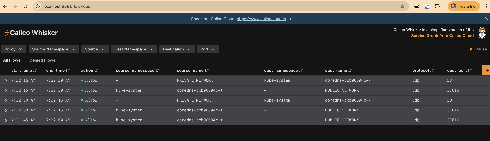

# How to enable Calico Whisker in a Manifest based install

The purpose of this tutorial is to reveal the behind-the-scenes magic that happens when you use the Tigera operator to install Calico.

Keep in mind that everything described here can be done using the tigera-operator and just two resources. In fact, with the operator installation method (which we recommend), you simply create these two resources, and the tigera-operator handles everything else automatically.

```bash
apiVersion: operator.tigera.io/v1
kind: Goldmane
metadata:
  name: default
---
apiVersion: operator.tigera.io/v1
kind: Whisker
metadata:
  name: default
```

# Requirements

While this tutorial can be read like your favorite cat scify, if you wish to replicate the same test in your environment there are a bunch of requirements that you need to install/have.
- Docker
- K3d
- Calico manifest based install v3.31.0
- OpenSSL (To issue and sign certificates)
- Internet

## Setup your cluster

> **Note** This guide was written and tested for Calico v3.31.0, and expects that you are running the same version. In a case that your Calico version might differ you might have to adjust some of the commands and deployments.

Ok, just like the matrix you have chosen the red pill and now I'm going to show you how deep the rabbit hole goes. For this tutorial we are going to use `k3d`, and `docker` (hence being a requirement). This will allow us to spin up a `k3s` cluster super fast.

```bash
k3d cluster create \
  my-calico-manifest-cluster \
  -s 1 -a 2 \
  --k3s-arg '--flannel-backend=none@server:*' \
  --k3s-arg '--disable-network-policy@server:*' \
  --k3s-arg '--disable=traefik@server:*' \
  --k3s-arg '--cluster-cidr=192.168.0.0/16@server:*'
```

## Install Calico and Typha in your cluster

Now that our cluster is ready, it’s time to install Calico. This time, we’ll install both Calico and Typha using manifests instead of the operator.

```bash
kubectl create -f https://raw.githubusercontent.com/projectcalico/calico/v3.31.0/manifests/calico-typha.yaml
```

**Note:** Currently, you need at least one instance of Typha running to use Goldmane and Whisker.

You can use the following command to verify if `calico-node` pods are running.
```bash
kubectl rollout status -n kube-system ds/calico-node
```
Keep in mind that a manifest-based install requires you—the administrator—to configure every part of Calico. While this approach offers a high degree of flexibility, it’s not without its challenges, such as missing YAML indentations or using values that are deprecated or unsupported in the current version of Calico.

This is why we recommend using the tigera-operator. It’s a dedicated operator (so good we’re saying it twice!) designed to configure and maintain your Calico installation—so you can focus on what matters most (ahem... vacations).

## Generating certificates

By default, a manifest-based install does not secure Calico components. It is the administrator’s responsibility to generate a Certificate Authority, issue and sign the necessary certificates, and rotate them on the desired schedule. Keep in mind that all of these steps are automated when using an operator-based installation.

### 🔐 Certificate Authority (CA)

To secure Calico components, we need a Certificate Authority (CA) to issue and sign our certificates. While this could be a publicly trusted CA that issues certificates for general use, we can also create our own internal CA to generate and sign these certificates for our specific needs.


Use the following command to establish a CA and generate its keys:
```bash
openssl genrsa -out certs/ca.key 2048

openssl req -new -x509 -key certs/ca.key \
    -subj '/CN=tigera-ca-bundle/O=We love Calico/C=US' \
    -days 1024 -out certs/ca.crt
```

### 📥 Generating a Certificate for calico-typha (Typha Server)

Calico Typha is a middleware key-value caching system designed to sit between `calico-node` requests and your Kubernetes `kube-apiserver`. This setup allows Typha to query the API server once and then serve the cached responses to all `calico-node` instances. If any changes occur within your Kubernetes cluster, Typha will trigger a new query to update its cache accordingly.

**Note:** Remember the `CN=` value used here and in the next step—these are referenced later in the Typha and Calico-node tuning section as part of the certificate verification process.

Use the following command to generate a certificate request for Typha:
```bash
openssl req \
  -newkey rsa:2048 -nodes -sha256 -keyout certs/typha-server.key \
  -subj '/CN=typha-server/O=We love Calico/C=US' \
  -out certs/typha-server.csr
```

Use the following command to sign and generate a certificate for Typha:
```bash
openssl x509 -req \
    -in certs/typha-server.csr \
    -CA certs/ca.crt -CAkey certs/ca.key \
    -out certs/typha-server.crt \
    -days 1024
```

### 📥 Generating a Certificate for Calico-Node (Typha Client)

In order to generate a certificate for the calico-node pod, you first need to create a certificate request. This is necessary because your CA must issue and sign all certificates.

Use the following command to generate a certificate request:
```bash
openssl req \
  -newkey rsa:2048 -nodes -sha256 -keyout certs/typha-client.key \
  -subj '/CN=typha-client/O=We love Calico/C=US' \
  -out certs/typha-client.csr
```

Use the following command to sign and generate the client certificates:
```bash
openssl x509 -req \
    -in certs/typha-client.csr \
    -CA certs/ca.crt -CAkey certs/ca.key \
    -out certs/typha-client.crt \
    -days 1024
```

### 📥 Generating Certificates for Goldmane and Whisker

Goldmane and Whisker certificates are a little different. Since these two components handle sensitive information—specifically Network Flow Logs—we need to assign specific roles to their certificates. Additionally, because these certificates will be used to emit flow logs from other workloads (such as calico-node in this example), we must include Subject Alternative Names (SANs) in the certificates.

Use the following command to generate a certificate `request` for Goldmane:
```bash
openssl req \
  -newkey rsa:2048 -nodes -sha256 -keyout certs/goldmane.key \
  -subj '/CN=goldmane/O=We love Calico/C=US' \
  -addext "subjectAltName=DNS:goldmane,DNS:goldmane.kube-system,DNS:goldmane.kube-system.svc,DNS:goldmane.kube-system.svc.cluster.local" \
  -out certs/goldmane.csr
```
Use the following command to generate a certificate `request` for Whisker:
```bash
openssl req \
  -newkey rsa:2048 -nodes -sha256 -keyout certs/whisker-backend.key \
  -subj '/CN=whisker-backend/O=We love Calico/C=US' \
  -addext "subjectAltName=DNS:whisker-backend,DNS:whisker-backend.kube-system,DNS:whisker-backend.kube-system.svc,DNS:whisker-backend.kube-system.svc.cluster.local" \
  -out certs/whisker-backend.csr
```

### Finishing the Certificate Requests and Signing Certificates with our CA

Great! Now that we have two certificate requests, it's time to sign them with our CA. This allows any workload using these certificates to verify their authenticity.

Use the following command to generate and sing your Goldmane certificate:
```bash
openssl x509 -req \
    -in certs/goldmane.csr \
    -CA certs/ca.crt -CAkey certs/ca.key \
    -out certs/goldmane.crt \
    -days 1024 \
    -sha256 -extensions v3_req -extfile certs/req-goldmane.conf
```
Do the same for Whisker:
```bash
openssl x509 -req \
    -in certs/whisker-backend.csr \
    -CA certs/ca.crt -CAkey certs/ca.key \
    -out certs/whisker-backend.crt \
    -days 1024 \
    -sha256 -extensions v3_req -extfile certs/req-whisker.conf
```

### Importing Certificates into the cluster

Now that all our certificates are signed and ready, let’s import them into our Kubernetes cluster as ConfigMaps and Secrets. This is a best practice because it allows us to easily update certificates by replacing these ConfigMaps and Secrets.

Use the following command to import all the Certificates into your cluster:
```
kubectl create configmap goldmane-ca-bundle \
  --namespace=kube-system \
  --from-file=ca-bundle.crt=./certs/ca.crt \
  --from-file=tigera-ca-bundle.crt=./certs/ca.crt \
  --dry-run=client -o yaml | kubectl apply -f -

kubectl create secret tls goldmane-key-pair \
  --cert=certs/goldmane.crt \
  --key=certs/goldmane.key \
  --namespace=kube-system \
  --dry-run=client -o yaml | kubectl apply -f -

kubectl create secret tls typha-client-key-pair \
  --cert=certs/typha-client.crt \
  --key=certs/typha-client.key \
  --namespace=kube-system \
  --dry-run=client -o yaml | kubectl apply -f -

kubectl create secret tls typha-server-key-pair \
  --cert=certs/typha-server.crt \
  --key=certs/typha-server.key \
  --namespace=kube-system \
  --dry-run=server -o yaml | kubectl apply -f -

kubectl create secret tls whisker-backend-key-pair \
  --cert=certs/whisker-backend.crt \
  --key=certs/whisker-backend.key \
  --namespace=kube-system \
  --dry-run=server -o yaml | kubectl apply -f -
```

If you’ve come here from a blog, now is the time to go back. The certificate generation step ends here.

## Tuning Typha to Use Certificates

Our next step is to assign certificates to Typha. To do this, you need to modify the calico-typha manifest by adding a VolumeMount to connect the previously generated secrets to the pods, adding a volume to mount them in the workloads, and setting several environment variables so Typha knows it’s certificate time.

Use the following command to modify your typha deployment:
```bash
kubectl patch deployment calico-typha -n kube-system --type=strategic -p='
{
  "spec": {
    "template": {
      "spec": {
        "volumes": [
          {
            "name": "config",
            "configMap": {
              "name": "goldmane",
              "defaultMode": 420
            }
          },
          {
            "name": "goldmane-ca-bundle",
            "configMap": {
              "name": "goldmane-ca-bundle",
              "defaultMode": 420
            }
          },
          {
            "name": "typha-server-key-pair",
            "secret": {
              "secretName": "typha-server-key-pair",
              "defaultMode": 420
            }
          }
        ],
        "containers": [
          {
            "name": "calico-typha",
            "env": [
              {
                "name": "TYPHA_CAFILE",
                "value": "/etc/pki/tls/certs/tigera-ca-bundle.crt"
              },
              {
                "name": "TYPHA_SERVERCERTFILE",
                "value": "/typha-server-key-pair/tls.crt"
              },
              {
                "name": "TYPHA_SERVERKEYFILE",
                "value": "/typha-server-key-pair/tls.key"
              },
              {
                "name": "TYPHA_CLIENTCN",
                "value": "typha-client"
              }
            ],
            "volumeMounts": [
              {
                "name": "goldmane-ca-bundle",
                "mountPath": "/etc/pki/tls/certs",
                "readOnly": true
              },
              {
                "name": "typha-server-key-pair",
                "mountPath": "/typha-server-key-pair",
                "readOnly": true
              }
            ]
          }
        ]
      }
    }
  }
}'
```

**Note**: We also share the CA certificate (but not the key). Since our CA is not a public or widely trusted CA, we use the `TYPHA_CAFILE` environment variable to inject the CA certificate into the Typha process.

## Tunning calico-node to use certificates

Now we need to do the same for `calico-node` daemonset,

**Note:** Since `calico-node` acts as a client, we set the `FELIX_TYPHACN` environment variable to `typha-server` so it matches the certificate issued earlier to the server. This provides `calico-node` with an additional verification check.

Use the following command to configure the `calico-node` daemonset to use certificates for communication with Typha:
```bash
kubectl patch ds calico-node -n kube-system --type=strategic -p='
{
  "spec": {
    "template": {
      "spec": {
        "volumes": [
          {
            "name": "config",
            "configMap": {
              "name": "goldmane",
              "defaultMode": 420
            }
          },
          {
            "name": "goldmane-ca-bundle",
            "configMap": {
              "name": "goldmane-ca-bundle",
              "defaultMode": 420
            }
          },
          {
            "name": "typha-client-key-pair",
            "secret": {
              "secretName": "typha-client-key-pair",
              "defaultMode": 420
            }
          }
        ],
        "containers": [
          {
            "name": "calico-node",
            "env": [
              {
                "name": "FELIX_TYPHACAFILE",
                "value": "/etc/pki/tls/certs/tigera-ca-bundle.crt"
              },
              {
                "name": "FELIX_TYPHACERTFILE",
                "value": "/typha-client-key-pair/tls.crt"
              },
              {
                "name": "FELIX_TYPHAKEYFILE",
                "value": "/typha-client-key-pair/tls.key"
              },
              {
                "name": "FELIX_TYPHAK8SNAMESPACE",
                "value": "kube-system"
              },
              {
                "name": "FELIX_TYPHACN",
                "value": "typha-server"
              }
            ],
            "volumeMounts": [
              {
                "name": "goldmane-ca-bundle",
                "mountPath": "/etc/pki/tls/certs",
                "readOnly": true
              },
              {
                "name": "typha-client-key-pair",
                "mountPath": "/typha-client-key-pair",
                "readOnly": true
              }
            ]
          }
        ]
      }
    }
  }
}'
```
Before proceeding to the next step, use the following command to ensure your changes have been applied to Calico and Typha.

Use the following command to verify:
```bash
kubectl rollout status -n kube-system ds/calico-node deployment/calico-typha
```

## Deploying Goldmane

Now that our Calico and Typha workloads are running and secured, let's start deploying Goldmane and Whisker.

First, we need a ServiceAccount. Service accounts provide workloads with an identity, allowing administrators to manage their permissions and access.

Use the following command to generate a service account for Goldmane:
```bash
kubectl create -f -<<EOF
apiVersion: v1
kind: ServiceAccount
metadata:
  name: goldmane
  namespace: kube-system
EOF
```

Next, we need to create a Service that points to the Goldmane ingestion port. This Service will be used by any emitter (in this case, `calico-node`) to send flow data to the Goldmane server.

Use the following command to generate the service:
```
kubectl create -f -<<EOF
apiVersion: v1
kind: Service
metadata:
  name: goldmane
  namespace: kube-system
spec:
  ports:
  - port: 7443
    protocol: TCP
    targetPort: 7443
  selector:
    k8s-app: goldmane
  sessionAffinity: None
  type: ClusterIP
EOF
```

The Goldmane binary looks for a configuration file at startup, so we need to provide that file when launching Goldmane.

Use the following command to generate the config file as a ConfigMap.
```bash
kubectl create -f -<<EOF
apiVersion: v1
data:
  config.json: '{"emitFlows":false}'
kind: ConfigMap
metadata:
  name: goldmane
  namespace: kube-system
EOF
```

### Tunning Goldmane Deployment

The Goldmane binary looks for specific indicators to adjust its behavior. Since certificates have a finite lifetime, we use environment variables to specify which certificates Goldmane should use.

Examine the following block, it is an example that illustrate the required changes in Goldmane deployment that you will deploy later.
```bash
        - name: SERVER_CERT_PATH
          value: /goldmane-key-pair/tls.crt
        - name: SERVER_KEY_PATH
          value: /goldmane-key-pair/tls.key
        - name: CA_CERT_PATH
          value: /etc/pki/tls/certs/tigera-ca-bundle.crt
```

Similar to the previous steps, we need to mount the VolumeMounts to the workload so they can be accessed from within the workload.
```bash
      volumes:
      - configMap:
          defaultMode: 420
          name: goldmane
        name: config
      - configMap:
          defaultMode: 420
          name: goldmane-ca-bundle
        name: goldmane-ca-bundle
      - name: goldmane-key-pair
        secret:
          defaultMode: 420
          secretName: goldmane-key-pair
```

Finally, we need to mount these VolumeMounts at their respective paths inside the workload.
```bash
        volumeMounts:
        - mountPath: /config
          name: config
          readOnly: true
        - mountPath: /etc/pki/tls/certs
          name: goldmane-ca-bundle
          readOnly: true
        - mountPath: /goldmane-key-pair
          name: goldmane-key-pair
          readOnly: true
```

**Note:** The following Gist file contains all the changes we reviewed above.

Use the following command to deploy Goldmane:
```bash
kubectl create -f https://gist.githubusercontent.com/frozenprocess/5555ec3266133e53510b4bda59f38e42/raw/7a7203c6ff7bb8b4cde29b94a6653bc016258b94/goldmane.yaml
```

## Deploying Whisker UI

Now that Goldmane is up and running, it’s time to set up the Whisker UI.

First, we need to create a ServiceAccount. Service accounts provide workloads with an identity, allowing administrators to control and manage their permissions.

Use the following command to create a ServiceAccount for Whisker:
```bash
kubectl create -f -<<EOF
apiVersion: v1
kind: ServiceAccount
metadata:
  name: whisker
  namespace: kube-system
EOF
```

Next, we need to create a Service that points to the Whisker UI port. This Service will be used by Whisker users (administrators) to view flow logs and policies within Whisker. Keep in mind, we recommend using a `ClusterIP` service since flow logs contain sensitive information.

Use the following command to generate the service:
```bash
kubectl create -f -<<EOF
apiVersion: v1
kind: Service
metadata:
  name: whisker
  namespace: kube-system
spec:
  ports:
  - port: 8081
    protocol: TCP
    targetPort: 8081
  selector:
    k8s-app: whisker
  sessionAffinity: None
  type: ClusterIP
EOF
```

### Tunning Whisker Deployment

Similar to the Goldmane binary, Whisker looks for specific indicators to adjust its behavior. Since certificates have a finite lifetime, we use environment variables to specify which certificates Whisker should use. Additionally, Whisker needs a URL to locate Goldmane, which is provided by setting the `GOLDMANE_HOST` environment variable in the deployment.

Examine the following block, it is an example that illustrate the required changes in Whisker deployment that you will deploy later.

```bash
      - env:
        - name: LOG_LEVEL
          value: INFO
        - name: PORT
          value: "3002"
        - name: GOLDMANE_HOST
          value: goldmane.kube-system.svc.cluster.local:7443
        - name: TLS_CERT_PATH
          value: /whisker-backend-key-pair/tls.crt
        - name: TLS_KEY_PATH
          value: /whisker-backend-key-pair/tls.key
```

Similar to the previous parts we need to mount the VolumeMounts to the workload so they an be accessed inside the workload.
```bash
        volumeMounts:
        - mountPath: /whisker-backend-key-pair
          name: whisker-backend-key-pair
          readOnly: true
        - mountPath: /etc/pki/tls/certs
          name: goldmane-ca-bundle
          readOnly: true
```

Finally, we need to mount these VolumeMounts in their respective path inside the workload.
```bash
      volumes:
      - name: whisker-backend-key-pair
        secret:
          defaultMode: 420
          secretName: whisker-backend-key-pair
      - configMap:
          defaultMode: 420
          name: goldmane-ca-bundle
        name: goldmane-ca-bundle
```
**Note:** The following Gist file contains all the changes we reviewed above.

Use the following command to deploy Whisker:
```bash
kubectl create -f https://gist.githubusercontent.com/frozenprocess/5555ec3266133e53510b4bda59f38e42/raw/7a7203c6ff7bb8b4cde29b94a6653bc016258b94/whisker.yaml
```

You can verify the Goldmane and Whisker deployments in a manifest-based install by using the following command:
```bash
kubectl rollout status -n kube-system deployment/goldmane
kubectl rollout status -n kube-system deployment/whisker
```

### Accessing Whisker

**Note:** The following step must be running if you want to access the Whisker UI using a ClusterIP service.

Open a new terminal and run the following command:
```bash
kubectl port-forward -n kube-system deployment/whisker 8081:8081
```

Now, open a browser and navigate to `localhost:8081`. You should see the Whisker UI. However, no flows will appear because flow generation happens in Felix (the "Brian" of Calico), and we haven’t yet configured Calico to enable it.

It’s time to tweak the environment variables again!

## Instructing Felix to generate Flows Logs and ship them to Goldmane

Now that all the certificates are in place, we just need to set two more environment variables in the `calico-node` daemonset to instruct Felix to enable flow log generation and specify where to send them—our Goldmane server.
```bash
        - name: FELIX_FLOWLOGSGOLDMANESERVER
          value: goldmane.kube-system.svc:7443
        - name: FELIX_FLOWLOGSFLUSHINTERVAL
          value: "15"
```

Use the following command to enable Flow Log generation:
```bash
kubectl patch ds calico-node -n kube-system --type=strategic -p='
{
  "spec": {
    "template": {
      "spec": {
        "containers": [
          {
            "name": "calico-node",
            "env": [
              {
                "name": "FELIX_FLOWLOGSGOLDMANESERVER",
                "value": "goldmane.kube-system.svc:7443"
              },
              {
                "name": "FELIX_FLOWLOGSFLUSHINTERVAL",
                "value": "15"
              }
            ]
          }
        ]
      }
    }
  }
}'
```

After this change, it will take a moment for all `calico-node` pods in your cluster to restart. However, if you check the Whisker UI, you might not see any flow logs appear immediately.

Ah, it's puzzle!

### It is always DNS

Up to this point, we have configured everything required for Goldmane and Whisker to run, and in an ideal scenario, things should work as expected. However, if you check the `calico-node` logs, you may see a warning similar to the following:


> You can use the following command to check for these errors in your environment:
> ```bash
> kubectl logs -fn kube-system ds/calico-node
> ```
>

```bash
2025-07-17 14:21:38.502 [WARNING][75] felix/client.go 175: Failed to connect to flow server error=rpc error: code = Unavailable desc = name resolver error: produced zero addresses target="dns:///goldmane.kube-system.svc:7443"
``` 

Ah, it seems there’s an issue. Back to Kubernetes 101: Pods can be connected either to the host network—meaning they communicate using the node’s IP address—or to a namespace network. This behavior is controlled by the `hostNetwork: true` field in your DaemonSet, Deployment, or Pod specification.

You might be wondering, what does this have to do with our DNS issue? Well, everything. From the perspective of `calico-node`, it tries to resolve the internal DNS record `goldmane.kube-system.svc`. However, this query is sent to the host’s DNS server and forwarders, which don’t know anything about Kubernetes records. To fix this, we need to change the `dnsPolicy` of our daemonset to `ClusterFirstWithHostNet`. This setting allows DNS queries to be routed through the cluster DNS first.


```bash
kubectl patch ds calico-node -n kube-system --type=strategic -p="\
{
  \"spec\": {
    \"template\": {
      \"spec\": {
        \"dnsPolicy\": \"ClusterFirstWithHostNet\"
      }
    }
  }
}"
```
You should be able to see some flows in your Whisker UI shortly.


Congratulations, you are running Calico Whisker in a manifest based installation!
